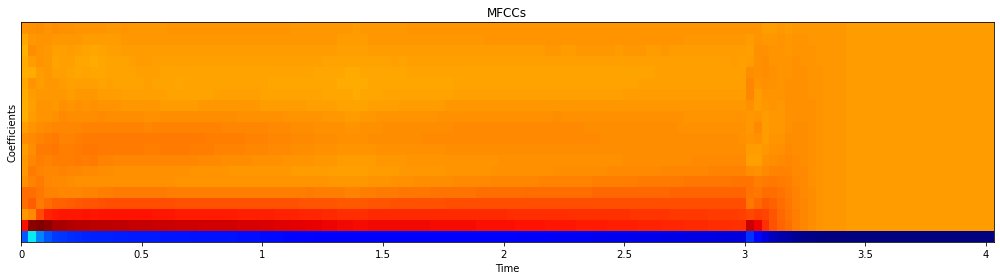
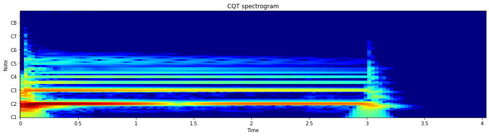
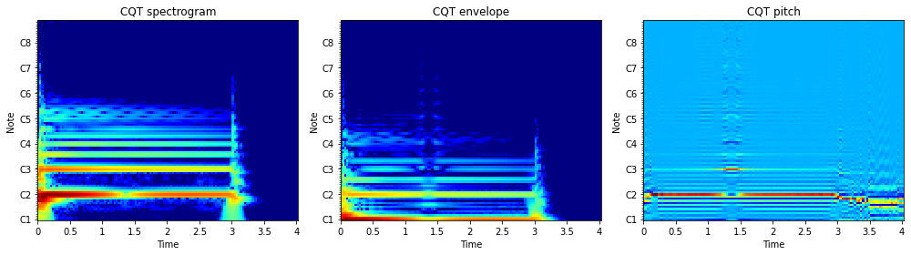
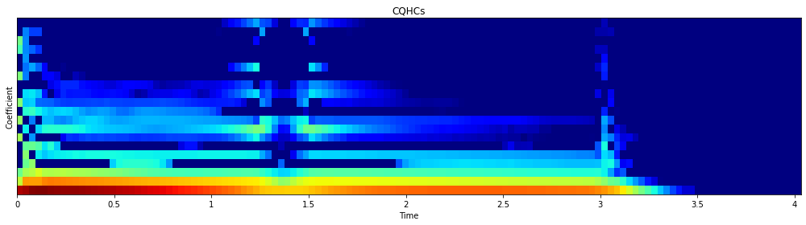

# CQHC-Python

The constant-Q harmonic coefficients (CQTHCs): a timbre feature designed for music signals.

Timbre is the attribute of sound which makes, for example, two musical instruments playing the same note sound different. It is typically associated with the spectral (but
also the temporal) envelope and assumed to be independent from the pitch (but also the loudness) of the sound. This will show how to design a simple but effective  pitch-independent timbre feature which is well adapted to musical data, by deriving it from the constant-Q transform (CQT), a log frequency transform which matches the typical Western musical scale. We will show how to decompose the CQT spectrum into an energy-normalized pitch component and a pitch-normalized spectral component, the latter from which we will extract a number of harmonic coefficients. We will then evaluate the discriminative power of these Constant Q harmonic coefficients (CQHCs) on the NSynth dataset, a large-scale dataset of musical notes which is publicly available, comparing them with the mel-frequency cepstral coefficients (MFCCs), features originally designed for speech recognition but commonly used to characterize timbre in music.

Files:
- [`cqhc.py`](#cqhcpy): Python module with the CQHCs and other related functions.
- [`examples.ipynb`](#examplesipynb): Jupyter notebook with some examples for the different functions of the Python module `cqhc`.
- [`tests.ipynb`](#testsipynb): Jupyter notebook with some tests for extracting and experimenting with the CQHCs (more personal).
- [`notes.ipynb`](#notesipynb): Jupyter notebook with some notes regarding the justification and evaluation of the CQHCs (more official).

- [`bass_acoustic_000-036-075.wav`](#bass_acoustic_000-036-075wav): audio file used for the tests and examples.

See also:
- [Zaf-Python](https://github.com/zafarrafii/Zaf-Python): Zafar's Audio Functions in Python for audio signal analysis.


## cqhc.py

This Python module implements the constant-Q harmonic coefficients (CQHCs) and other related functions. 

Simply copy the file `cqhc.py` in your working directory and you are good to go. Make sure you have Python 3 and NumPy installed.

Functions:
- [`mfcc`](#mfcc) - Compute the mel-frequency cepstral coefficients (MFCCs) (using librosa).
- [`cqtspectrogram`](#cqtspectrogram) - Compute the (magnitude) constant-Q transform (CQT) spectrogram (using librosa).
- [`cqtdeconv`](#cqtdeconv) - Deconvolve the CQT spectrogram into a pitch-normalized spectral component and an energy-normalized pitch component.
- [`cqhc`](#cqtsc) - Compute the CQHCs.


### mfcc

Compute the mel-frequency cepstral coefficients (MFCCs) (using librosa).

```
audio_mfcc = cqhc.mfcc(audio_signal, sampling_frequency, window_length, step_length, number_coefficients)
    
Inputs:
    audio_signal: audio signal (number_samples,)
    sampling_frequency: sampling frequency in Hz
    window_length: window length in samples
    step_length: step length in samples
    number_coefficients: number of MFCCs (default: 20 coefficients)
Output:
    audio_mfcc: audio MFCCs (number_coefficients, number_frames)
```

#### Example: Compute the MFCCs from an audio file.
```
# Import the modules
import numpy as np
import cqhc
import librosa
import librosa.display
import matplotlib.pyplot as plt

# Load the audio signal
file_path = r'bass_acoustic_000-036-075.wav'
audio_signal, sampling_frequency = librosa.load(file_path, sr=None, mono=True)

# Define the parameters and compute the MFCCs
window_length = pow(2, int(np.ceil(np.log2(0.04 * sampling_frequency))))
step_length = int(window_length / 2)
number_coefficients = 20
audio_mfcc = cqhc.mfcc(audio_signal, sampling_frequency, window_length, step_length, number_coefficients)

# Display the MFCCs
plt.figure(figsize=(14, 4))
librosa.display.specshow(audio_mfcc, x_axis='time', sr=sampling_frequency, hop_length=step_length, cmap='jet')
plt.title('MFCCs')
plt.ylabel('Coefficient')
plt.tight_layout()
plt.show()
```




### cqtspectrogram

Compute the (magnitude) constant-Q transform (CQT) spectrogram (using librosa).

```
cqt_spectrogram = cqhc.cqtspectrogram(audio_signal, sampling_frequency, step_length, minimum_frequency, octave_resolution)
    
Inputs:
    audio_signal: audio signal (number_samples,)
    sampling_frequency: sampling frequency in Hz
    step_length: step length in samples
    minimum_frequency: minimum frequency in Hz (default: 32.70 Hz = C1)
    octave_resolution: number of frequency channels per octave (default: 12 frequency channels per octave)
Output:
    cqt_spectrogram: magnitude CQT spectrogram (number_frequencies, number_frames)
```

#### Example: Compute the CQT spectrogram from an audio file.
```
# Import the modules
import numpy as np
import cqhc
import librosa
import librosa.display
import matplotlib.pyplot as plt

# Load the audio signal
file_path = r'bass_acoustic_000-036-075.wav'
audio_signal, sampling_frequency = librosa.load(file_path, sr=None, mono=True)

# Define the parameters and compute the CQT spectrogram
step_length = int(pow(2, int(np.ceil(np.log2(0.04 * sampling_frequency)))) / 2)
minimum_frequency = 32.70
octave_resolution = 12
cqt_spectrogram = cqhc.cqtspectrogram(audio_signal, sampling_frequency, step_length, minimum_frequency, \
                                      octave_resolution)

# Display the CQT spectrogram
plt.figure(figsize=(14, 4))
librosa.display.specshow(librosa.amplitude_to_db(cqt_spectrogram), x_axis='time', y_axis='cqt_note', \
                         sr=sampling_frequency, hop_length=step_length, fmin=minimum_frequency, \
                         bins_per_octave=octave_resolution, cmap='jet')
plt.title('CQT spectrogram')
plt.tight_layout()
plt.show()
```




### cqtdeconv

Deconvolve the constant-Q transform (CQT) spectrogram into a pitch-normalized spectral component and an energy-normalized pitch component.

```
spectral_component, pitch_component = cqhc.cqtdeconv(cqt_spectrogram)

Inputs:
    cqt_spectrogram: CQT spectrogram (number_frequencies, number_frames)
Output:
    spectral_component: pitch-normalized spectral component (number_frequencies, number_frames)
    pitch_component: energy-normalized pitch component (number_frequencies, number_frames)
```

#### Example: Deconvolve a CQT spectrogram into its spectral component and pitch component.
```
# Import the modules
import numpy as np
import cqhc
import librosa
import librosa.display
import matplotlib.pyplot as plt

# Load the audio signal
file_path = r'bass_acoustic_000-036-075.wav'
audio_signal, sampling_frequency = librosa.load(file_path, sr=None, mono=True)

# Define the parameters and compute the CQT spectrogram
step_length = int(pow(2, int(np.ceil(np.log2(0.04 * sampling_frequency)))) / 2)
minimum_frequency = 32.70
octave_resolution = 12
cqt_spectrogram = cqhc.cqtspectrogram(audio_signal, sampling_frequency, step_length, minimum_frequency, octave_resolution)

# Deconvolve the CQT spectrogram into a spectral component and pitch component
spectral_component, pitch_component = cqhc.cqtdeconv(cqt_spectrogram)

# Display the CQT spectrogram, spectral component, and pitch component
plt.figure(figsize=(14, 4))
plt.subplot(1, 3, 1)
librosa.display.specshow(librosa.amplitude_to_db(cqt_spectrogram), x_axis='time', y_axis='cqt_note', \
                         sr=sampling_frequency, hop_length=step_length, fmin=minimum_frequency, \
                         bins_per_octave=octave_resolution, cmap='jet')
plt.title('CQT spectrogram')
plt.subplot(1, 3, 2)
librosa.display.specshow(librosa.amplitude_to_db(spectral_component), x_axis='time', y_axis='cqt_note', \
                         sr=sampling_frequency, hop_length=step_length, fmin=minimum_frequency, \
                         bins_per_octave=octave_resolution, cmap='jet')
plt.title('Spectral component')
plt.subplot(1, 3, 3)
librosa.display.specshow(pitch_component, x_axis='time', y_axis='cqt_note', sr=sampling_frequency, \
                         hop_length=step_length, fmin=minimum_frequency, bins_per_octave=octave_resolution, cmap='jet')
plt.title('Pitch component')
plt.tight_layout()
plt.show()
```




### cqhc

Compute the constant-Q harmonic coefficients (CQHCs).

```
audio_cqhc = cqhc.cqhc(audio_signal, sampling_frequency, step_length, minimum_frequency, octave_resolution, number_coefficients)

Inputs:
    audio_signal: audio signal (number_samples,)
    sampling_frequency: sampling frequency in Hz
    step_length: step length in samples
    minimum_frequency: minimum frequency in Hz (default: 32.70 Hz = C1)
    octave_resolution: number of frequency channels per octave (default: 12 frequency channels per octave)
    number_coefficients: number of CQHCs (default: 20 coefficients)
Output:
    audio_cqhc: CQHCs (number_coefficients, number_frames)
```

#### Example: Compute the CQHCs from an audio file.
```
# Import the modules
import numpy as np
import cqhc
import librosa
import librosa.display
import matplotlib.pyplot as plt

# Load the audio signal
file_path = r'bass_acoustic_000-036-075.wav'
audio_signal, sampling_frequency = librosa.load(file_path, sr=None, mono=True)

# Define the parameters and compute the CQHCs
step_length = int(pow(2, int(np.ceil(np.log2(0.04 * sampling_frequency)))) / 2)
minimum_frequency = 32.70
octave_resolution = 12
number_coefficients = 20
audio_cqhc = cqhc.cqhc(audio_signal, sampling_frequency, step_length, minimum_frequency, octave_resolution, \
                       number_coefficients)

# Display the CQHCs
plt.figure(figsize=(14, 4))
librosa.display.specshow(librosa.power_to_db(audio_cqhc), x_axis='time', sr=sampling_frequency, hop_length=step_length, \
                         cmap='jet')
plt.title('CQHCs')
plt.ylabel('Coefficient')
plt.tight_layout()
plt.show()
```




## examples.ipynb

This Jupyter notebook shows some examples for the different functions of the Python module `cqhc`.

See [Jupyter notebook viewer](https://nbviewer.jupyter.org/github/zafarrafii/CQHC-Python/blob/master/examples.ipynb).


## tests.ipynb

This Jupyter notebook shows some tests for extracting and experimenting with the constant-Q harmonic coefficients (CQHCs) (more personal).

See [Jupyter notebook viewer](https://nbviewer.jupyter.org/github/zafarrafii/CQHC-Python/blob/master/tests.ipynb).


## notes.ipynb

This Jupyter notebook shows some notes regarding the justification and evaluation of the constant-Q harmonic coefficients (CQHCs) (more official).

See [Jupyter notebook viewer](https://nbviewer.jupyter.org/github/zafarrafii/CQHC-Python/blob/master/notes.ipynb).


## bass_acoustic_000-036-075.wav

WAV file with 4 second musical note of an acoustic bass playing C2 (65.41 Hz), from the [NSynth dataset](https://magenta.tensorflow.org/datasets/nsynth).


# References

- Brian McFee, Collin Raffel, Dawen Liang, Daniel PW Ellis, Matt McVicar, Eric Battenberg, and Oriol Nieto, "librosa: Audio and Music Signal Analysis in Python," 14th Python in Science Conference, Austin, TX, USA, July 6-12 2015 [[URL](https://arxiv.org/abs/1704.01279)]

- Jesse Engel, Cinjon Resnick, Adam Roberts, Sander Dieleman, Douglas Eck, Karen Simonyan, and Mohammad Norouzi, "Neural Audio Synthesis of Musical Notes with WaveNet
Autoencoders," *34th International Conference on Machine Learning*, Sydney, NSW, Australia, August 6-11 2017 [[URL](https://librosa.org/doc/latest/index.html#)]

- Zafar Rafii, "The Constant-Q Harmonic Coefficients: A Timbre Feature Designed for Music Signals," *IEEE Signal Processing Magazine*, vol. 35, no. 3, May 2022.

# Author

- Zafar Rafii
- zafarrafii@gmail.com
- http://zafarrafii.com/
- [CV](http://zafarrafii.com/Zafar%20Rafii%20-%20C.V..pdf)
- [GitHub](https://github.com/zafarrafii)
- [LinkedIn](https://www.linkedin.com/in/zafarrafii/)
- [Google Scholar](https://scholar.google.com/citations?user=8wbS2EsAAAAJ&hl=en)
